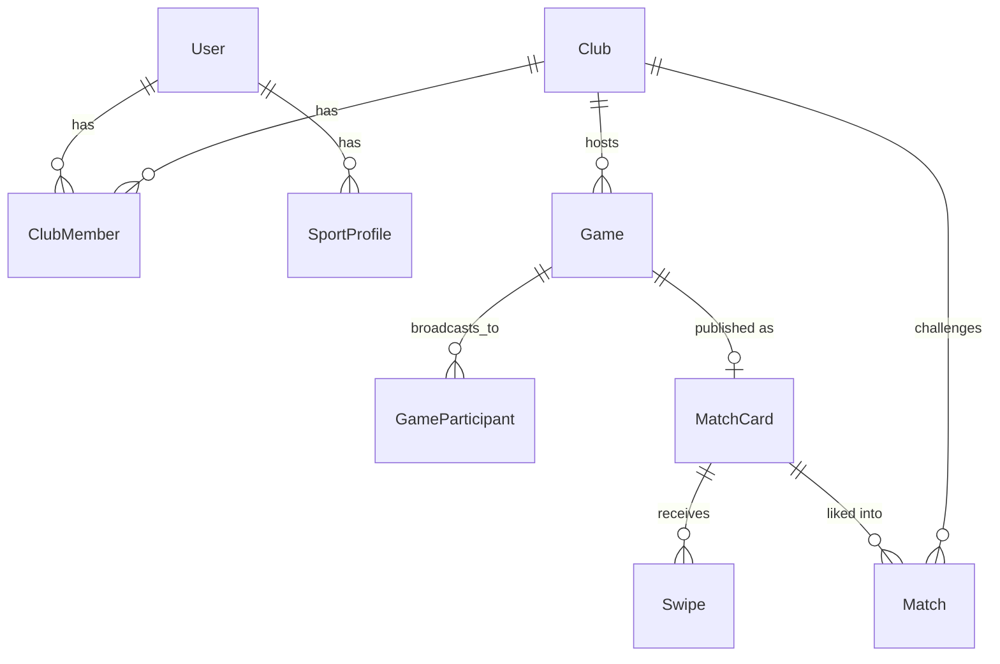

# TurfMatch — Data Model & API Design

Based on your wireframes: a club owner creates a game, it broadcasts to his own
club's members (accept/reject), and it's also published as a swipeable "Tinder
card" so *other* club owners can discover it and request to play (club vs
club, e.g. 8v8).

---

## 1. Core Concept — Two Loops

**Loop A — Internal (fill your own roster)**
Owner creates a game → broadcast to club members → members swipe/tap
accept/reject → owner sees accepted/pending/rejected lists.

**Loop B — External (find an opponent club)**
Owner publishes the game as a Tinder card → other club owners see it in their
swipe deck → an owner swipes "like" (wants this match) → original owner
accepts the tinder match → fixture is locked (both clubs confirmed, venue/day/time set).

A `Game` is host-club-owned. Loop A fills your own team's players. Loop B
finds you an opposing club. A game can run through either loop, or both.

---

## 2. Data Model

### User
| Field | Type | Notes |
|---|---|---|
| id | uuid | |
| name | string | |
| phone | string | verified via OTP (matches "Phone verified" in mock) |
| email | string, nullable | |
| created_at | datetime | |

### Club
| Field | Type | Notes |
|---|---|---|
| id | uuid | |
| name | string | e.g. "Data FC" |
| area | string | e.g. "Andheri West" |
| city | string | e.g. "Mumbai" |
| owner_id | FK → User | primary owner |
| roster_count | int | denormalized "10 players total" |
| availability | string | e.g. "Weeknights after 8 PM" |
| preferred_format | string | e.g. "Club vs club", "8v8" |
| skill_level | enum | beginner / intermediate / advanced |
| home_turf | string | e.g. "Arena 52" |
| created_at | datetime | |

### ClubMember (junction)
| Field | Type | Notes |
|---|---|---|
| id | uuid | |
| club_id | FK → Club | |
| user_id | FK → User | |
| role | enum | owner / captain / admin / player |
| status | enum | active / pending / removed |
| joined_at | datetime | |

### SportProfile (player profile, per sport — "game 1: football", "game#2: cricket")
| Field | Type | Notes |
|---|---|---|
| id | uuid | |
| user_id | FK → User | |
| sport | string | football, cricket, etc. |
| skill | enum | beginner / intermediate / advanced |
| position | string | e.g. striker, keeper |

### Game (created by owner — the source of truth for a match)
| Field | Type | Notes |
|---|---|---|
| id | uuid | |
| club_id | FK → Club | host club |
| created_by | FK → User | owner |
| captain_admin_id | FK → User | manages roster day-of |
| sport | string | |
| format | string | "8v8" |
| venue | string | |
| date | date | |
| time | time | |
| day | string | denormalized, e.g. "Tuesday" |
| cost_per_person | decimal | ("contry per person" in your notes) |
| capacity_total | int | total players needed, e.g. 16 |
| open_slots | int | spots still needed from an opponent club |
| opponent_club_id | FK → Club, nullable | set once matched via Loop B |
| status | enum | `draft → broadcasting → published → matched → completed → cancelled` |
| created_at / updated_at | datetime | |

### GameParticipant (Loop A — internal broadcast responses)
| Field | Type | Notes |
|---|---|---|
| id | uuid | |
| game_id | FK → Game | |
| user_id | FK → User | club member who got the broadcast |
| status | enum | pending / accepted / rejected |
| responded_at | datetime, nullable | |

This is what powers `accepted players[]`, `pending players[]`, `rejected
players[]` on the Game screen, and the ✓ / ✗ actions on the player's "matches
request" screen.

### MatchCard (Loop B — the public, abstracted "Tinder card" for a Game)
| Field | Type | Notes |
|---|---|---|
| id | uuid | |
| game_id | FK → Game, 1:1 | |
| club_id | FK → Club | host club |
| sport / format | string | |
| venue_area | string | show area only, not exact address, until matched |
| day / time | string/time | |
| skill_level | enum | |
| open_slots | int | e.g. "2 players available" |
| status | enum | active / matched / expired / cancelled |
| published_at | datetime | |

This deliberately **hides** `accepted/pending/rejected players[]` and internal
roster — that's the "some abstractions" you noted vs. the plain Game screen.

### Swipe (an owner swiping on someone else's MatchCard)
| Field | Type | Notes |
|---|---|---|
| id | uuid | |
| match_card_id | FK → MatchCard | |
| swiping_club_id | FK → Club | |
| swiping_owner_id | FK → User | |
| direction | enum | like / pass |
| created_at | datetime | |

Unique constraint on `(match_card_id, swiping_club_id)` — one swipe per club per card.

### Match (a "like" that becomes a real club-vs-club fixture)
| Field | Type | Notes |
|---|---|---|
| id | uuid | |
| match_card_id | FK → MatchCard | |
| game_id | FK → Game | |
| host_club_id | FK → Club | |
| challenger_club_id | FK → Club | |
| challenger_owner_id | FK → User | |
| status | enum | pending / confirmed / rejected / cancelled / completed |
| created_at / confirmed_at | datetime | |

### Relationships (ER overview)



---

## 3. API Design

Grouped to match your two API blocks, plus the small amount of plumbing
they depend on (auth, feed, swipe) that wasn't spelled out but is implied.

### Auth (needed by both roles)
| Method | Path | Purpose |
|---|---|---|
| POST | `/auth/signup` | Normal Player: `signup()` |
| POST | `/auth/verify-otp` | phone verification |
| POST | `/auth/login` | Normal Player: `Login()` |

### Club (setup, implied by "clubs (whatsgroup): owner/captain/admin")
| Method | Path | Purpose |
|---|---|---|
| POST | `/clubs` | owner creates/registers a club |
| GET | `/clubs/:clubId` | club profile screen |
| PATCH | `/clubs/:clubId` | edit club profile / match setup |
| GET | `/clubs/:clubId/members` | list members + roles |
| POST | `/clubs/:clubId/members` | add/invite member |

### Profile (Normal Player)
| Method | Path | Purpose |
|---|---|---|
| GET | `/users/me` | `get profile()` |
| POST | `/users/me/sport-profiles` | add a sport (football/cricket) with skill/position |
| PATCH | `/users/me/sport-profiles/:sport` | update skill/position |

### Game — Owner side
| Method | Path | Purpose |
|---|---|---|
| POST | `/clubs/:clubId/games` | `create game()` — venue, day, time, format, cost/person, captain |
| GET | `/games/:id` | game screen detail |
| PATCH | `/games/:id` | edit game |
| POST | `/games/:id/broadcast` | `request players()` — creates a `GameParticipant` row for every club member, fires notification |
| GET | `/games/:id/participants?status=accepted\|pending\|rejected` | populate the three lists on the Game screen |
| POST | `/games/:id/publish` | `upload tinder request()` — creates the `MatchCard` for this game |

### Game — Normal Player side
| Method | Path | Purpose |
|---|---|---|
| GET | `/users/me/games/upcoming` | `get upcoming matches()` — the "matches request screen" feed |
| GET | `/games/:id` | `view game details()` |
| POST | `/games/:id/respond` | body: `{ "status": "accepted" \| "rejected" }` — `accept a game()` / `reject a game()`, the ✓ / ✗ icons |

### Tinder / Swipe discovery — Owner side
| Method | Path | Purpose |
|---|---|---|
| GET | `/match-cards/feed?sport=&city=&skill=` | deck of other clubs' open cards to swipe (excludes own club) |
| POST | `/match-cards/:id/swipe` | body: `{ "direction": "like" \| "pass" }` — swiping owner's action; a "like" creates a `Match` with status `pending` |
| GET | `/clubs/:clubId/matches/incoming?status=pending` | requests other clubs have sent by liking your card |
| POST | `/matches/:id/accept` | `accept tinder match()` — host owner confirms → `Match.status = confirmed`, `Game.status = matched`, `Game.opponent_club_id` set |
| POST | `/matches/:id/reject` | decline the incoming request |
| GET | `/matches/:id` | confirmed fixture detail (both clubs, venue, day, time) |

---

## 4. Example Payloads

**Create game**
```json
POST /clubs/{clubId}/games
{
  "sport": "football",
  "format": "8v8",
  "venue": "Arena 52",
  "date": "2026-08-25",
  "time": "20:00",
  "cost_per_person": 300,
  "captain_admin_id": "user_123",
  "capacity_total": 16
}
```

**Publish as tinder card**
```json
POST /games/{gameId}/publish
{
  "open_slots": 2,
  "skill_level": "intermediate"
}
```
Response includes `match_card_id`, now visible in other clubs' `/match-cards/feed`.

**Swipe**
```json
POST /match-cards/{id}/swipe
{ "direction": "like" }
```
→ returns `{ "match_id": "m_789", "status": "pending" }`

**Accept tinder match**
```json
POST /matches/{matchId}/accept
```
→ `{ "status": "confirmed", "game_id": "g_456", "opponent_club_id": "c_222" }`

---

## 5. State Machines

**Game.status**
`draft → broadcasting → published → matched → completed`
(`cancelled` reachable from any pre-completed state)

**Match.status**
`pending → confirmed → completed`
(`rejected` / `cancelled` reachable from `pending`/`confirmed`)

---

## 6. End-to-End Flow

1. Owner signs up, registers `Club` (name, area, home turf, availability).
2. Owner `create game()` → `Game` in `draft`.
3. Owner `request players()` → broadcasts to `ClubMember`s → status `broadcasting` → members `accept`/`reject` via their "upcoming matches" screen.
4. Once roster/interest looks good, owner `upload tinder request()` → `MatchCard` created, `Game.status = published`.
5. Other club owners browse `/match-cards/feed`, `swipe` right on the card.
6. Host owner sees it under incoming matches, `accept tinder match()` → `Match.status = confirmed`, `Game.status = matched`, opponent club attached.
7. Both clubs now see the fixture on their "upcoming matches" screens with full venue/day/time.

---

### Notes / open questions worth deciding before you build
- Do you want mutual swiping (both sides must like) or is a single "like → owner accepts" enough? The model above assumes the latter, matching your named `accept tinder match()` API.
- Should `open_slots` decrement automatically as multiple challenger clubs are accepted (e.g. a game could take players from more than one opposing club), or is it strictly one club vs one club per game? The model above assumes one-to-one.
